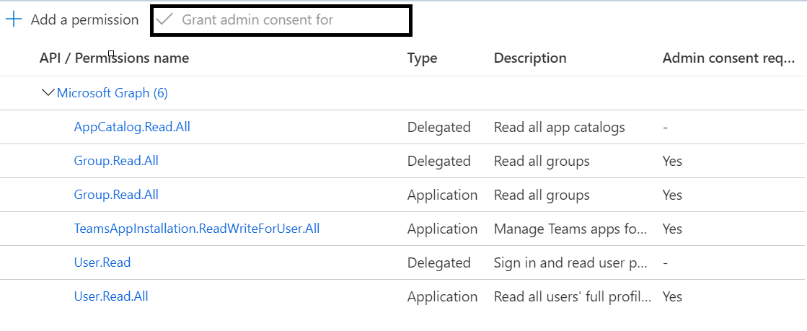

# Troubleshooting guide

**Generic possible issues**

Certain issues can arise that are common to many of the app templates. Please refer to this [link](https://github.com/OfficeDev/microsoft-teams-stickers-app/wiki/Troubleshooting).

**Common issues with Powershell script deployment**

**1. File is not digitally signed**

While running PowerShell script, you may get an error: `File is not digitally signed`

**Fix** : If this type of error occurs then run this: `Set-ExecutionPolicy -ExecutionPolicy unrestricted`  and re-run the script.

**2. Azure subscription access failed**

`Connect-AzAccount : The provided account \*\*.onmicrosoft.com does not have access to subscription ID XXXX. Please try logging in with different credentials or a different subscription ID.`

**Fix** : The signed-in user must be added as a contributor in the Azure subscription. Either login with another account or add the user as a contributer.

**3. Failed to acquire a token**

`Exception calling AcquireAccessToken with 1 argument(s): multiple\_matching\_tokens\_detected: The cache contains multiple tokens satisfying the requirements`

**Fix** : This means user is logged-in with multiple accounts in the current powershell session. Close the powershell window and re-run the script in a new window.

**4. Authorization failed**

**Description**

The resources created by ARM template requires a sync with latest code, so it can run with latest update.

**Fix** :

To avoid automate sync issue the current user should have admin privilege.

> **Note**: This will not impact the app deployment. To get the latest code you must sync the resources - functions and webapp manually. 

**5. Azure AD App permissions consent error**

**Description**

The apps created by this app template requires an admin consent for below graph permission so it can operate correctly.
* AppCatalog.Read.All (Delegated)
* Group.Read.All (Delegated)
* Group.Read.All (Application)
* TeamsAppInstallation.ReadWriteForUser.All (Application)
* User.Read.All (Delegated)
* User.Read (Application)

**Fix**

Please ask your tenant administrator to consent the permissions for Azure AD app.

**6. Error while deploying the ARM Template**

**Description**

`Errors: The resource operation completed with terminal provisioning state "Failed"`

This may happen if the resources were already created or due to conflicts.

**Fix**

Navigate to the deployment center and check the deployment status for the failed resources in the Azure portal. Check the error logs to understand why the deployment failed.

In most of the scenarios you may need to either redeploy the application (using scripts) or sync manually.